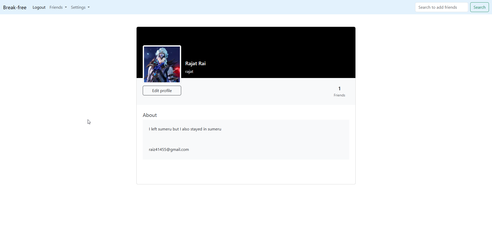
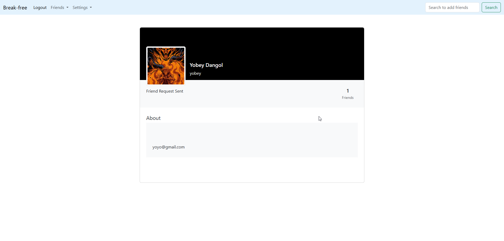
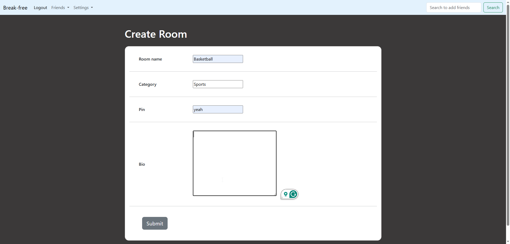
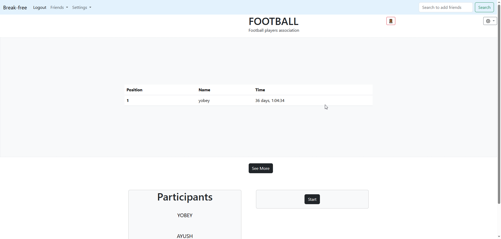

<div align="center">

# BreakFree
This is a Habit Tracker website where you can add friends, make room and count days for anything you like. I am building this project because the leaderboard system with your friends who have similars goals can increase everyones determination and make it more videogame like sense of satisfaction. 
</div>

<div style="text-align: center;">
    <p>Profile</p>
    
</div>

<div style="text-align: center;">
    <p>Add Friend</p>
    
</div>

<div style="text-align: center;">
    <p>Create Room</p>
    
</div>

<div style="text-align: center;">
    <p>Room</p>
    
</div>

<p>
This is a django full stack app with no seperate frontend and now it's deployed on https://breakfree-production-c468.up.railway.app/ 
The base folder has the entire app in it. it's the only app in this project. 
Its dockerized and and has no additional containers, I have used the default sqlite as database.
It uses gunicorn for webserver but i used whitenoise to serve static files instead of nginx to reduce complexity and quick deployment 
</p>

<p>
As of right now I am working to convert this MVT project into a REST API using DRF in this repo https://github.com/rajatbhai980/breakfree-api-
It has the same code structure but I am using postgresql on this project and i will use more backend tools on this one and it will have a more complex environment 
compared to this project according the apps needs.</p>

### Cloning the repository

--> Clone the repository using the command below :
```bash
git clone https://github.com/rajatbhai980/breakfree.git

```

--> Move into the directory where we have the project files : 
```bash
cd breakfree

```

--> Create a virtual environment:
```bash
python -m venv env 

```

--> Activate the virtual environment(You need to activate the virtual environment each time you restart the IDE) :
```bash
env\scripts\activate

```

--> Install the requirements :
```bash
python -m pip install -r requirements.txt

```
 

#

### Running the App

--> To run the App, we use :
```bash
python manage.py runserver

```

> ⚠ Then, the development server will be started at http://127.0.0.1:8000/

#
